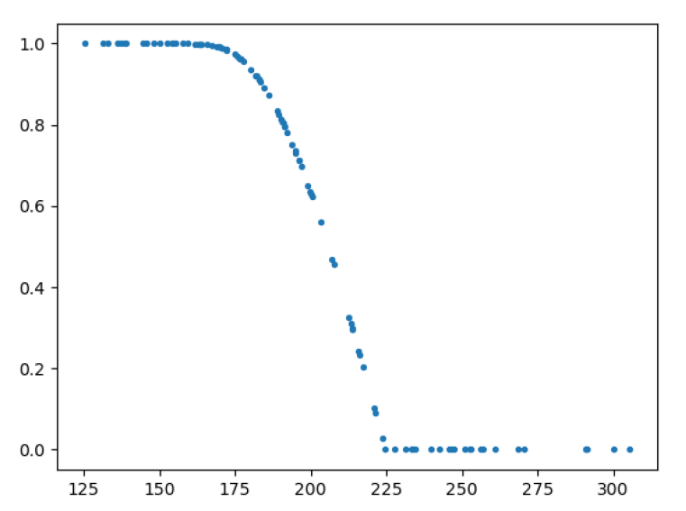

# 面向对象第一单元第二次作业指导书

## 摘要

本次作业，需要完成的任务为**包含简单幂函数和简单正余弦函数的导函数**的求解。

## 问题

### 设定

首先是一些基本概念的声明：

- **带符号整数** **支持前导0**的**十**进制带符号整数（若为正数，则正号可省略），无进制标识，如： `+02`，`-16`，`19260817`。

- **因子** 
  
  - **常数因子** 包含一个带符号整数，如：`233`。
  - **变量因子** 
    - **幂函数** 
      - **一般形式** 由自变量x，指数符号`**`和指数组成，指数为一个带符号整数，如：`x ** +2`。
      - **省略形式** 当指数为1时，可省略指数符号`**`和指数，如：`x`。
    - **三角函数** `sin(x)`或`cos(x)`（在本次作业中，括号内仅为x）
      - **一般形式** 类似于幂函数，由`sin(x)`或`cos(x)`、指数符号`**`和指数组成，指数为一个带符号整数，如：`sin(x) ** +2`。
      - **省略形式** 当指数为1时，可省略指数符号`**`和指数，如：`sin(x)`。
  - **表达式因子** 由一对小括号及其包裹的表达式组成，如：`(x**2 + 2*x)`。表达式的定义将在表达式的相关设定中进行详细介绍。
  - **补充**
    - **表达式因子不支持幂运算**，例如```(1113*x)**62621```**不是合法的因子**。
  
- **项** 
  
  - **一般形式** 由乘法运算符连接若干因子组成，如：`2 * x ** 2 * 3 * x ** -2`，`sin(x) * cos(x) * x`，`(-1 + x ** 233) * sin(x)`。
  - **特殊形式**
    - 第一个因子为常数因子，值为1且**总共不止有一个因子**时，可省略该常数因子或表示为正号开头的形式，如：`x ** 2 * x ** -1`，`+ x ** 2`，`+ cos(x) * cos(x)`，`sin(x) * cos(x) * x`。
    - 第一个因子为常数因子，值为-1且**总共不止有一个因子**时，可表示为负号开头的形式，如：`-x ** 2`，`- cos(x) * sin(x)`。
  
- **表达式** 由加法和减法运算符连接若干项组成，如： `(-1 + x ** 233) * x ** 06 - sin(x) * 3 * sin(x)`。此外，**在第一项之前**，**可以带一个正号或者负号**，来表示第一项的正负，如：`- -1 + x ** 233`，`+ -2 + x ** 19260817`。

  - **项**的个数至少为一，**空串不属于合法的表达式**。
- 由表达式的定义可知，表达式因子可存在递归嵌套，如：`(x ** 2 + (1 + 2 * x))`，`(-x ** 3 + (x ** 2 + sin(x)))`。
  
- **空白字符**在本次作业中，空白字符包含且仅包含空格`<space>`（ASCII值32）和水平制表符`\t`（ASCII值9）。其他空白字符，均属于非法字符。

  对于空白字符，有以下几条规定：

  - 带符号整数内不允许包含空白字符，注意带符号整数本身的**符号与整数之间**也不允许包含空白字符。
  - 指数运算符内不允许包含空白字符，如`*  *`不合法。 
  - 三角函数的保留字内不允许包含空白字符，即`sin`，`cos`关键字内不可以含有空白字符。
  - 因子、项、表达式，在不与以上三条规定矛盾的前提下，可以在任意位置包含任意数量的空白字符。

### 设定的形式化表述

- 表达式 $\rightarrow$ 空白项 [加减 空白项] 项 空白项 | 表达式 加减 空白项 项 空白项
- 项 $\rightarrow$ [加减 空白项] 因子 | 项 空白项 * 空白项 因子
- 因子 $\rightarrow$ 变量因子 | 常数因子 | 表达式因子
- 变量因子 $\rightarrow$ 幂函数 | 三角函数
- 常数因子 $\rightarrow$ 带符号的整数
- 表达式因子 $\rightarrow$ '(' 表达式 ')'
- 幂函数 $\rightarrow$ x [空白项 指数]
- 三角函数 $\rightarrow$ sin 空白项 '(' 空白项 x 空白项 ')' [空白项 指数] | cos 空白项 '(' 空白项 x 空白项 ')' [空白项 指数]
- 指数 $\rightarrow$  ** 空白项 带符号的整数
- 带符号的整数 $\rightarrow$ [加减] 允许前导零的整数
- 允许前导零的整数 $\rightarrow$ (0|1|2|…|9){0|1|2|…|9}
- 空白字符 $\rightarrow$ ` `（空格） | `\t`
- 空白项 $\rightarrow$ {空白字符}
- 加减 $\rightarrow$ + | -

其中{}表示0个、1个或多个，[]表示0个或1个，|表示多个之中选择。

式子的具体含义参照其数学含义。

若输入字符串能够由“表达式”推导得出，则输入字符串合法。具体推导方法请参阅 “第一单元形式化表述说明” 文档。

### 描述

求导是数学计算中的一个计算方法，其定义为，当自变量的增量趋于零时，因变量的增量与自变量的增量之商的极限。

在本次作业中，需对输入表达式进行求导运算，化简并输出运算结果。

**本次作业可能用到的求导公式有： **
$$
Ⅰ.当f\left(x\right) = c（c为常数）时，f'\left(x\right) = 0
$$

$$
Ⅱ. 当f(x) = x^n（n \neq 0）时，f'(x) = nx^{n-1}
$$

$$
Ⅲ. 当f(x) = \sin(x)时，f'(x) = \cos(x)
$$

$$
Ⅳ. 当f(x) = \cos(x)时，f'(x) = -\sin(x)
$$

$$
Ⅴ. 链式法则：[f(g(x))]' = f'(g(x))g'(x)
$$

$$
Ⅵ.乘法法则：[f\left(x\right)g\left(x\right)]' = f'\left(x\right)g\left(x\right)+f\left(x\right)g'\left(x\right)
$$

例如：
$$
Ⅰ. 当f(x) = 2x^6 + 6x^4时，f'(x) = 12x^5 + 24x^3
$$
输入为`2*x**6+6*x**4`，输出为`12*x**5+24*x**3`。
$$
Ⅱ. 当f(x) = 2\sin(x) + 4\cos(x)时，f'(x) = 2\cos(x) - 4\sin(x)
$$
输入为`2*sin(x)+4*cos(x)`，输出为`2*cos(x)-4*sin(x)`。
$$
Ⅲ. 当f(x) = 2\sin^2(x) + 6\cos^3(x)时，f'(x) = 4\cos(x)\sin(x)-18\cos^2(x)\sin(x)
$$
输入为`2*sin(x)**2 + 6*cos(x)**3`，输出为`4*cos(x)*sin(x)-18*cos(x)**2*sin(x)`。

### 一些规定

- 一个表达式可能有多个解释。因此，对于一个表达式，只要存在一条合法解释，该表达式即合法，我们保证这些解释在数学意义上均相等。

## 判定

### 输入格式

输入中，包含且仅包含一行，表示一个表达式。

**本次作业保证输入数据全部为合法（格式正确）的表达式，不需要进行格式检查！！！**

### 数据限制

+ **数据的最大长度为150**（请注意，这里不是有效长度，是去除右侧换行符后的总长度），并且是**合法的**表达式。
+ **所有指数的绝对值不大于10000**。

在测试中，不会出现不符合该限制的数据。在此限制内，不作任何其他限制。

### 输出格式

由于本次作业输入数据全部为合法的表达式，因此程序不需要对输入数据的合法性进行判定。

关于输出：

- 应当输出一行，表示求得的导函数。格式同样需要符合前述表达式基本规则，其中要求带符号整数均为**十进制形式**。
- 为了方便评测，输出的表达式的**所有指数的绝对值不得超过$10^{10}$**,且**输出总长度不得超过$10^4$**。不符合该要求的输出视为**输出错误**。例如对于输入`x`，若输出为`0 * x ** 10000000001 + 1`，则认定为输出错误。显然，在前述数据限制下，正确的输出可以不出现指数的绝对值超过$10^{10}$以及总长度超过$10^4$的情况。

### **判定模式**

#### 正确性判定

对于这次作业结果正确性的判定，在输出符合格式要求的前提下，我们采用如下的方式：

* **在区间$ [-10, 10] $上，进行1000次线性随机选取**，设得到的数为$\left\{ x_{i} \right\}$ ($1 \leq i \leq 1000$)
* 设输入表达式为$f\left(x\right)$，其导函数为$f'\left( x \right)$（即正确答案，由sympy进行符号运算），将$\left\{ x_{i} \right\}$依次代入$f'\left(x\right)$，得到结果$\left\{ a_{i} \right\}$
* 设待测输出表达式为$g'\left(x\right)$，将$\left\{x_i\right\}$依次代入$g'\left(x\right)$，得到结果$\left\{ b_i \right\}$
* 将数列$\left\{a_i\right\}$和数列$\left\{b_i\right\}$进行比较，判定每个数是否依次相等
* **如果全部相等，则认为该组输出正确**，否则认为错误。

其中

* 在比较两个数时，**判定相等的依据**是：对于数$a_i$表示正确结果，数$b_i$表示根据输出计算出的结果，若满足

$$
\frac{\left| a_i - b_i \right|}{\max\left( \left| a_i \right|, 1 \right)} < {10}^{-3}
$$

则视为$a_i$与$b_i$相等。

* 考虑到可能会出现随机出的数位于无意义点上导致计算出错，故在上述计算$b_i$的过程中，**如果第$i$个数计算错误，则将重新生成该$x_i$，并重新计算**。每个数最多将会重试五次，如果重试次数达到上限后依然无法正常计算，则判定该组输出错误。**举例说明的话，就是表达式$\frac{x^2}{x}$最终也会被判定为和表达式$x$等价**。(由$a_i$不可计算引发的重新计算将不被计算在这五次内)

简而言之，可以理解为：**只要是和标准结果等价的表达式（允许定义域上的点差异），都会被认定为正确答案**。

#### 性能分判定

在本次作业中，性能分的唯一评判依据，是输出结果的有效长度。

有效长度定义为，输出结果去除所有的空白字符（`<space>`、`\t`）后的长度，设为$L$。

设某同学给出的正确答案的有效长度为$L_p$，所有人目前给出的正确答案的有效长度的最小值为$L_{min}$，最大值为$L_{max}$，平均值为$L_{avg}$。

设 

$base_{min} = p\cdot L_{avg}+(1-p)\cdot L_{min}$，

$base_{max}=p\cdot L_{max}+(1-p)\cdot L_{avg}$，

$p=0.25$

则该同学性能分百分比为：
$$
r(L_p)= 100 \% \cdot
\begin{cases}
1 & L_p \leq base_{min} \\
1-10^{1-\frac{base_{max}-base_{min}}{L_p-base_{min}}} & base_{min} < L_p \leq base_{max} \\
0 & L_p > base_{max}
\end{cases}
$$
以下是用正态分布生成的一组数据，模拟的性能分得分情况，



需要注意的是，**获得性能分的前提是，在正确性判定环节被判定为正确**。如果被判定为错误，则性能分部分为0分。

**注**：本次作业强测中性能分占比为**20%**

### 互测相关

在互测环节

* **数据的最大长度为60**（请注意，这里不是有效长度，是去除右侧换行符后的总长度），并且是**合法的**表达式。
* **所有指数的绝对值不大于10000**。

如果不满足上述数据限制，该数据将被系统忽略，不会对被测程序进行测试。


## 样例

|  #   | 输入                      | 输出                                      | 解释                                            |
| :--: | ------------------------- | ----------------------------------------- | ----------------------------------------------- |
|  1   | 1                         | 0                                         | 根据表达式定义可得。                            |
|  2   | 4*x+ x**2 +x+1            | 2*x+5                                     | 根据表达式定义可得。                            |
|  3   | 4*x+ x**2 +x              | 4+2*x+1                                   | 未合并同类项，但表达式依然等价。                |
|  4   | - -4*x + x ** 2 + x       | 2*x+5                                     | -4*x为合法项，且表达式第一项前也可以包含正负号。 |
|  5   | +4*x - -x**2 + x          | 2*x+5                                     | -x**2为合法项。                                 |
|  6   | +19260817*x              | 19260817                                  | 根据表达式定义可得。                            |
|  7   | + 19260817*x             | 19260817                                  | 表达式第一项前可以带有正负号。               |
|  8  | 2*sin(x)                  | 2*cos(x)                                  | 根据表达式定义可得。                            |
|  9  | -2*cos(x)                 | 2*sin(x)                                  | 根据表达式定义可得。                            |
|  10  | 23+sin(x)*3+x**8         | 3\*cos(x)+8\*x**7                         | 根据表达式定义可得。                            |
|  11  | cos(x)* sin(x)* 5+4 *x**3 | -5\*sin(x)\**2+5\*cos(x)\*cos(x)+12\*x**2 | 根据表达式定义可得。                            |
|  12  | 43+4*x**3                 | 12*x**2                                   | 根据表达式定义可得。                            |
|  13  | 5* x\*\*4* sin(x)         | 5\*x\*\*4\*cos(x) + 20\*x**3\*sin(x)      | 根据表达式定义可得。                            |
|  14  | 5* x\*\*4* cos(x)         | 20\*x\*\*3\*cos(x) - 5\*x**4\*sin(x)      | 根据表达式定义可得。                            |
|  15  | 2\*x**2\*3                | 12*x                                      | 根据表达式定义可得。                            |
|  16  | (2\*x+sin(x))\*x**3 | (8+cos(x))\*x\*\*3+3\*sin(x)\*x\*\*2 | 根据表达式定义可得。                            |
|  17  | (cos(x))\*(sin(x)) | 1-2*sin(x)**2 | 根据表达式定义可得。                            |

注意：由于本作业可被判定为正确的答案不唯一，以上样例的输出**仅保证正确性，但并不一定为性能最优解**。

## 补充信息

### 关于评测

* 评测时，会自动忽略掉行末的空格以及文件末多余的回车。
* 对于输入，如果包含多行，则忽略第一行以后的内容即可。
* 类似地，对于输出结果，如果包含多行，则在评测时将忽略第一行以后的内容。（也就是说，你们可以在正文之后附加一些其他的信息以改善自己调试的体验）

### 一点点提示

* Java内的原生整数类型有`long`和`int`，长度分别为64位和32位。
* 如果觉得上述数据类型不够用的话，可以百度一下Java内可以怎样快速处理这个问题，也可以回顾一下pre第2弹的指导书。
* 在Java内，不建议使用静态数组。推荐使用`ArrayList`、`HashMap`、`HashSet`一类的数据结构，快速管理和调配手中无序的数据。
* 关于输入字符串的处理，推荐使用**正则表达式**，相关的API可以了解`Pattern`和`Matcher`类。
* 本次作业用到的数学相关知识均为高中数学，部分求导公式的推算要仔细。
* 如果希望代码可扩展性更加良好，可以了解一下**工厂模式**。
* 如果需要用`HashMap`处理多个Key的应用场景，有两种做法可以选择：
  * 多层`HashMap`嵌套，形如`HashMap<int, HashMap<int, int>>`
  * 【推荐】自定义一个类，包含该多个Key，将这个类作为`HashMap`的Key类型，并实现这个类的哈希函数`int hashCode()`和相等性判定函数`boolean equals(Object obj)`。更多的具体细节可以自行查找相关资料并实践研究。

- 这次作业，看上去似乎很难，其实找对了方法后并不难。关键思想是，**化整为零**，可以这样考虑
  * 对于每一种函数（常数、幂函数、三角函数），建立类
  * 对于每一种函数组合规则（乘法、加减法、嵌套），建立类
  * 对于上述的两种类，均实现一个求导接口
    * 其中，第一种类，做法显而易见
    * 其中，第二种类，做法一样显而易见
  * 通过上述两种类及其求导接口，把整个表达式构建为树结构，进行链式求导。

- 对于秒掉正确性部分后，想要最大限度优化性能的<del>大佬</del>同学，一样可以将上述的化整为零思想作为可行思路之一，设计算法。

### 一点点想说的话

* **不要重复造轮子！不要重复造轮子！不要重复造轮子！**<del>重要的事情说三遍</del>
* 我们鼓励大家通过Baidu、Google、Stackoverflow等方式自行学习和解决问题。
* 如果还有更多的问题，请到讨论区提问。但是**请善用讨论区**，并在此之前认真阅读包括但不限于课程要求文档、指导书、搜索引擎结果等的内容。
* 如果想要深入了解Java的一些内置数据结构的特性和原理，推荐以下方法：
  * 查阅官方文档
  * 阅读该部分源代码（另外，在Idea内，Ctrl+左键点击方法名、变量名、类名、包名，有惊喜）
* 对于学有余力的大佬们，可以在写这次作业之余，思考一下**建立什么样的对象模型，可以使你的程序更方便支持进一步的功能扩展，使程序可以真正做到实用化**。预祝你们能在下一次作业中如鱼得水。
